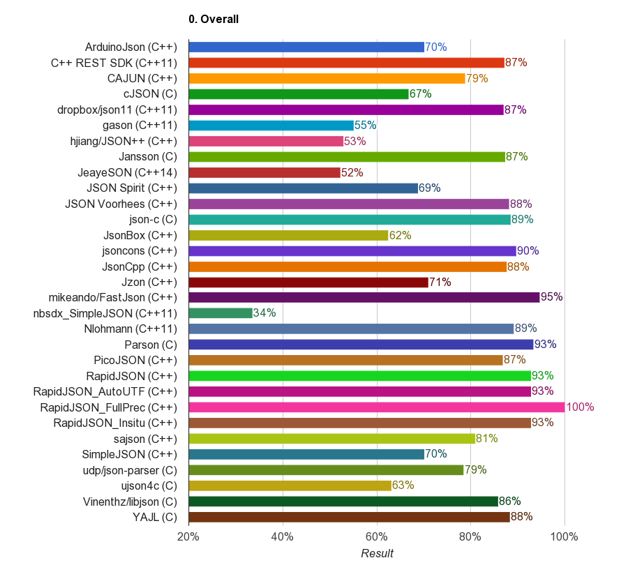

# Native JSON Benchmark

Copyright(c) 2014-2016 Milo Yip (miloyip@gmail.com)

## Introduction

This benchmark evaluates the conformance and performance of 41 open-source C/C++ libraries with JSON parsing/generation capabilities. Performance means speed, memory, and code size.

Performance should be concerned only if the results are correct. This benchmark also test the conformance of library towards the JSON standards ([RFC7159], [ECMA-404]).

Performance of JSON parsing/generation may be critical for server-side applications, mobile/embedded systems, or any application that requires processing of large size or number of JSONs. Native (C/C++) libraries are important because they should provide the best possible performance, while other languages may create bindings of native libraries.

The results show that several performance measurements vary in large scale among libraries. For example, the parsing time can be over 100 times. These differences came from many factors, including design and implementation details. For example, memory allocation strategies, design of variant type for JSON, number-string conversions, etc.

This benchmark may be useful for optimizing existing libraries and developing new, high-performance libraries.

## Disclaimer

The original author (Milo Yip) of this benchmark is also the primary author of [RapidJSON](https://github.com/miloyip/rapidjson).

Although the development of benchmark is attempted to be as objective and fair as possible, every benchmarks have their drawbacks, and are limited to particular testing procedures, datasets and platforms. And also, this benchmark does not compare additional features that a library may support, or the user-friendliness of APIs, securities, cross-platform, etc. The author encourage users to benchmarks with their own data sets and platforms.

## Benchmarks and Measurements

### Conformance

Benchmark        | Description
-----------------|---------------------------------------------------
Parse Validation | Use [JSON_checker](http://www.json.org/JSON_checker/) test suite to test whether the library can identify valid and invalid JSONs. (`fail01.json` is excluded as it is relaxed in [RFC7159]. `fail18.json` is excluded as depth of JSON is not specified.)
Parse Double     | 66 JSONs, each with a decimal value in an array, are parsed. The parsed `double` values are compared to the correct answer.
Parse String     | 9 JSONs, each with a string value in an array, are parsed. The parsed strings are compared to the correct answer.
Roundtrip        | 27 condensed JSONs are parsed and stringified. The results are compared to the original JSONs.

### Performance

Benchmark      | Description
---------------|----------------------------------------------------
Parse          | Parse in-memory JSON into DOM (tree structure).
Stringify      | Serialize DOM into condensed JSON in memory.
Prettify       | Serialize DOM into prettified (with indentation and new lines) JSON in memory.
Statistics     | Traverse DOM and count the number of JSON types, total length of string, and total numbers of elements/members in array/objects.
Sax Round-trip | Parse in-memory JSON into events and use events to generate JSON in memory.
Sax Statistics | Parse in-memory JSON into events and use events to conduct the statistics.
Code size      | Executable size in byte. (Currently only support `jsonstat` program, which calls "Parse" and "Statistics" to print out statistics of a JSON file. )

All benchmarks contain the following measurements:

Measurement | Description
------------|----------------------------------------------------
Time        | Duration in millisecond
Memory      | Memory consumption in bytes for the result data structure.
MemoryPeak  | Peak memory consumption in bytes throughout the parsing process.
AllocCount  | Number of memory allocation (including `malloc`, `realloc()`, `new` et al.)

## Libraries

Currently 43 libraries are successfully benchmarked. They are listed in alphabetic order:

Library | Language | Version | Notes
--------|----------|---------|-------------------
[ArduinoJson](https://github.com/bblanchon/ArduinoJson) | C++ | 5.6.6
[CAJUN](https://github.com/cajun-jsonapi/cajun-jsonapi) | C++ | 2.0.3
[C++ REST SDK](https://github.com/Microsoft/cpprestsdk) | C++11 | v2.8.0 | Need Boost on non-Windows platform. DOM strings must be UTF16 on Windows and UTF8 on non-Windows platform.
[ccan/json](https://github.com/rustyrussell/ccan/) | C | 
[cJSON](https://github.com/DaveGamble/cJSON) | C | 1.5.0 |
[Configuru](https://github.com/emilk/Configuru) | C++ | 2015-12-18 | gcc/clang only |
[dropbox/json11](https://github.com/dropbox/json11) | C++11 | 
[Facil.io](https://github.com/boazsegev/facil.io) | C | 0.5.3 | 
[FastJson](https://github.com/mikeando/fastjson) | C++ | | Not parsing number per se, so do it as post-process.
[folly](https://github.com/facebook/folly) | C++11 | 2016.08.29.00 | Need installation |
[gason](https://github.com/vivkin/gason) | C++11 | 
[jansson](https://github.com/akheron/jansson) | C | v2.7
[jeayeson](https://github.com/jeaye/jeayeson) | C++14
[json-c](https://github.com/json-c/json-c) | C | 0.12.1
[jsoncons](https://github.com/danielaparker/jsoncons) | C++11 | 0.97.1
[json-voorhees](https://github.com/tgockel/json-voorhees) | C++ | v1.1.1
[json spirit](http://www.codeproject.com/Articles/20027/JSON-Spirit-A-C-JSON-Parser-Generator-Implemented) | C++ | 4.08 | Need Boost
[Json Box](https://github.com/anhero/JsonBox) | C++ | 0.6.2
[JsonCpp](https://github.com/open-source-parsers/jsoncpp) | C++ | 1.0.0
[hjiang/JSON++](https://github.com/hjiang/jsonxx) | C++ | 
[jsmn](https://github.com/zserge/jsmn) | C | | Not parsing number per se, so do it as post-process.
[jvar](https://github.com/YasserAsmi/jvar) | C++ | v1.0.0 | gcc/clang only |
[Jzon](https://github.com/Zguy/Jzon) | C++ | v2-1
[nbsdx/SimpleJSON](https://github.com/nbsdx/SimpleJSON) | C++11 |
[Nlohmann/json](https://github.com/nlohmann/json) | C++11 | v2.0.3
[parson](https://github.com/kgabis/parson) | C | 
[picojson](https://github.com/kazuho/picojson) | C++ | 1.3.0
[pjson](https://github.com/ony/pjson) | C | | No numbers parsing, no DOM interface
[POCO](https://github.com/pocoproject/poco) | C++ | 1.7.5 | Need installation |
[qajson4c](https://github.com/USESystemEngineeringBV/qajson4c) | C | 1.0.0 | gcc/clang only |
[Qt](http://www.qt.io/) | C++ | 5.6.1-1 | Need installation |
[RapidJSON](https://github.com/miloyip/rapidjson) | C++ | v1.1.0 | There are four configurations: RapidJSON (default), RapidJSON_AutoUTF (transcoding any UTF JSON), RapidJSON_Insitu (*insitu* parsing) & RapidJSON_FullPrec (full precision number parsing)
[sajson](https://github.com/chadaustin/sajson) | C++ | 
[SimpleJSON](https://github.com/MJPA/SimpleJSON) | C++ | 
[sheredom/json.h](https://github.com/sheredom/json.h) | C | | Not parsing number per se, so do it as post-process.
udp/json | C | 1.1.0 | Actually 2 libraries: [udp/json-parser](https://github.com/udp/json-parser) & [udp/json-builder](https://github.com/udp/json-builder).
[taocpp/json](https://github.com/taocpp/json) | C++11 | 1.0.0-beta.7 | Uses [PEGTL](https://github.com/taocpp/PEGTL) for parsing
[tunnuz/JSON++](https://github.com/tunnuz/json) | C++ |
[ujson](https://bitbucket.org/awangk/ujson/) | C++ | 2015-04-12 |
[ujson4c](https://github.com/esnme/ujson4c) | C | 
[V8](https://github.com/v8/v8) | C++ | 5.1.281.47 | Need installation |
[vincenthz/libjson](https://github.com/vincenthz/libjson) | C | 0.8
[YAJL](https://github.com/lloyd/yajl) | C | 2.1.0
[ULib](https://github.com/stefanocasazza/ULib/tree/master) | C++ | v1.4.2 | Need building: (./configure --disable-shared && make) |

Libraries with Git repository are included as submodule in `thirdparty` path. Other libraries are add as files in `thirdparty` path.

The exact commit of submodule can be navigated at [here](https://github.com/miloyip/nativejson-benchmark/tree/master/thirdparty).

To measure the overheads of the benchmark process, a `strdup` test is added for comparison. It simply allocate and copy the input string in Parse and Stringify benchmark.

Besides, some libraries was tried to integrated in this benchmark but failed:

Library   | Issue
----------|------------------------------
[libjson](http://sourceforge.net/projects/libjson/) | Unable to parse UTF-8 string
[lastjson](https://github.com/lastfm/last.json) | 
[StiX Json](https://bitbucket.org/StiX/stix-json) |
[boost property_tree](http://www.boost.org/doc/libs/1_60_0/doc/html/property_tree.html) | number, true, false, null types are converted into string.

## JSON data

All tested JSON data are in UTF-8.

JSON file   | Size | Description
------------|------|-----------------------
`canada.json` [source](https://github.com/mloskot/json_benchmark/blob/master/data/canada.json) | 2199KB | Contour of Canada border in [GeoJSON](http://geojson.org/) format. Contains a lot of real numbers.
`citm_catalog.json` [source](https://github.com/RichardHightower/json-parsers-benchmark/blob/master/data/citm_catalog.json) | 1737KB | A big benchmark file with indentation used in several Java JSON parser benchmarks.
`twitter.json` | 632KB | Search "一" (character of "one" in Japanese and Chinese) in Twitter public time line for gathering some tweets with CJK characters.

The benchmark program reads `data/data.txt` which contains file names of JSON to be tested.

## Build and Run

1. Execute `git submodule update --init` to download all submodules (libraries).
2. Obtain [premake5](https://premake.github.io/download).
3. Copy premake5 executable to `build/` path (or system path).
4. Run `premake.bat` or `premake.sh` in `build/`
5. On Windows, build the solution at `build/vs2015/`.
6. On other platforms, run GNU `make -f benchmark.make config=release_x32 && make -f nativejson.make config=release_x32` (or `release_x64`) at `build/gmake/`
7. Optional: run `build/machine.sh` for UNIX or CYGWIN to use CPU info to generate prefix of result filename.
8. Run the `nativejson_release_...` executable is generated at `bin/`
9. The results in CSV format will be written to `result/`.
10. Run GNU `make` in `result/` to generate results in HTML.

For simplicity, on Linux/OSX users can simply run `make` (or `make CONFIG=release_x32`) at project root to run 4-10 above.

Some libraries, such as Boost, POCO, V8, etc., need to be installed by user manually.

## Sample Results

Update on: 2016-9-9

A collection of benchmarks results can be viewed [HERE](https://rawgit.com/miloyip/nativejson-benchmark/master/sample/conformance.html). Select "Benchmark" from the menu to check available benchmark configurations. The presentation is powered by [Google Charts](https://developers.google.com/chart/) with interactivity.

The followings are some snapshots from the results of MacBook Pro (Retina, 15-inch, Mid 2015, Corei7-4980HQ@2.80GHz) with clang 7.0 64-bit.

### Conformance

This is the average score of 4 conformance benchmarks. Higher is better. [Details](https://rawgit.com/miloyip/nativejson-benchmark/master/sample/conformance.html).

### Parsing Time

.png)

This is the total duration of parsing 3 JSONs to DOM representation, sorted in ascending order. Lower is better. [Details](https://rawgit.com/miloyip/nativejson-benchmark/master/sample/performance_Corei7-4980HQ@2.80GHz_mac64_clang7.0.html#1.%20Parse)

### Parsing Memory

.png)

This is the total memory after parsing 3 JSONs to DOM representation, sorted in ascending order. Lower is better. [Details](https://rawgit.com/miloyip/nativejson-benchmark/master/sample/performance_Corei7-4980HQ@2.80GHz_mac64_clang7.0.html#1.%20Parse)

(Note: The results for Qt is incorrect as the benchmark failed to hook its memory allocations)

### Stringify Time

.png)

This is the total duration of stringifying 3 DOMs to JSONs, sorted in ascending order. Lower is better. [Details](https://rawgit.com/miloyip/nativejson-benchmark/master/sample/performance_Corei7-4980HQ@2.80GHz_mac64_clang7.0.html#2.%20Stringify)

### Prettify Time

.png)

This is the total duration of prettifying 3 DOMs to JSONs, sorted in ascending order. Lower is better. [Details](https://rawgit.com/miloyip/nativejson-benchmark/master/sample/performance_Corei7-4980HQ@2.80GHz_mac64_clang7.0.html#2.%20Prettify)

### Code Size

.png)

The is the size of executable program, which parses a JSON from `stdin` to a DOM and then computes the statistics of the DOM. Lower is better. [Details](https://rawgit.com/miloyip/nativejson-benchmark/master/sample/performance_Corei7-4980HQ@2.80GHz_mac64_clang7.0.html#7.%20Code%20size)

## FAQ

1. How to add a library?

   Use `submodule add https://...xxx.git thirdparty/xxx` to add the libary's repository as a submobule. If that is not possible, just copy the files into 'thirdparty/xxx'.

   For C libary, add a `xxx_all.c` in `src/cjsonlibs`, which `#include` all the necessary `.c` files of the library. And then create a `tests/xxxtest.cpp`.it

   For C++ library, just need to create a `tests/xxxtest.cpp`, which `#include` all the necessary `.cpp` files of the library.

   You may find a existing library which similar to your case as a start of implementing `tests/xxxtest.cpp`.

   Please submit a pull request if the integration work properly.

2. What if the build process is failed, or the benchmark crashes?

   This happens on some platforms as not every libaray is stable for all platforms.

   You can simply delete the local `tests/xxxtest.cpp` and re-run the build.

   BTW, if you are adding a library, you can remove all `tests/xxxtest.cpp` except `tests/rapidjsontest.cpp` and your test. This make the build process fast. RapidJSON's test is needed as a reference to compare statistics results only.

3. On which platform the benchmark can be run?

   The author tests it on OSX/clang, Winwdows/vs2015, Ubuntu/clang3.7+gcc5.0 (via Travis CI). The benchmark may work in other platforms as well but you will need to generate the build files via premake5, and resolve any potential issues.

4. How to reduce the build process time?

   You can preserve the tests of libaries that you only need, as in question 2. You can also use `make ARGS=--verify-only`, `make ARGS=--performance-only`, `make ARGS=--conformance-only` to execute the required part.

## Other native JSON benchmarks

* [Basic benchmarks for miscellaneous C++ JSON parsers and generators](https://github.com/mloskot/json_benchmark) by Mateusz Loskot (Jun 2013)
 * [Casablanca](https://casablanca.codeplex.com/)
 * [json spirit](https://github.com/cierelabs/json_spirit)
 * [JsonCpp](https://github.com/open-source-parsers/jsoncpp)
 * [libjson](http://sourceforge.net/projects/libjson/)
 * [rapidjson](https://github.com/miloyip/rapidjson/)
 * [QJsonDocument](http://qt-project.org/doc/qt-5.0/qtcore/qjsondocument.html)
 
* [JSON Parser Benchmarking](http://chadaustin.me/2013/01/json-parser-benchmarking/) by Chad Austin (Jan 2013)
 * [sajson](https://github.com/chadaustin/sajson)
 * [RapidJSON](https://github.com/miloyip/rapidjson/)
 * [vjson](https://code.google.com/p/vjson/) (Replaced by gason)
 * [YAJL](http://lloyd.github.com/yajl/)
 * [Jansson](http://www.digip.org/jansson/)

[RFC7159]: http://www.ietf.org/rfc/rfc7159.txt
[ECMA-404]: http://www.ecma-international.org/publications/standards/Ecma-404.htm
